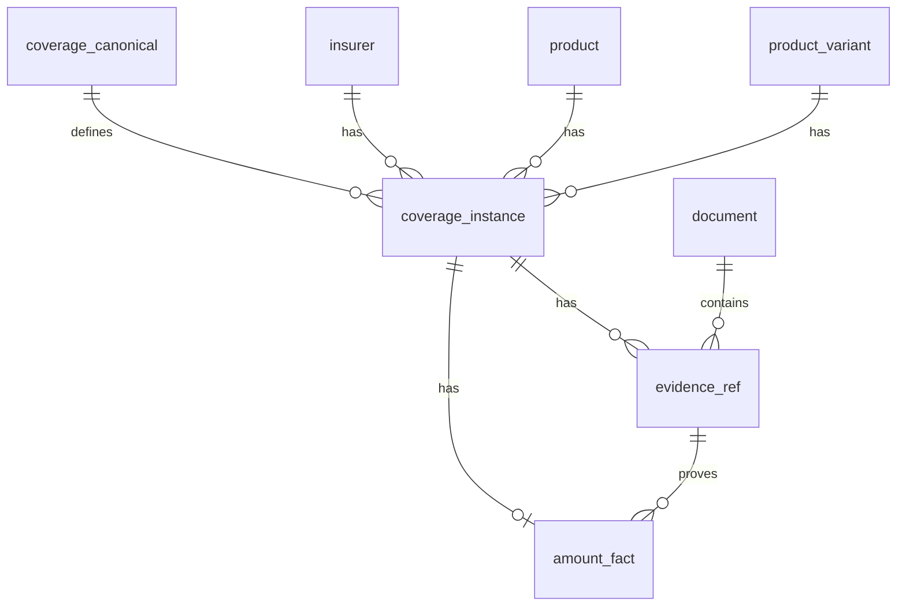

# DB PHYSICAL MODEL EXTENDED – inca-rag-scope

**Version**: 1.0
**Date**: 2025-12-28
**Status**: DESIGN SPECIFICATION (No Implementation)

---

## 0. PURPOSE

Extend the DB Physical Model with 4 new tables to store **Coverage**, **CoverageInstance**, **Evidence**, and **Amount** facts.

**Scope**: DDL specifications, FK relationships, constraints, indexes.
**Out of Scope**: Database creation, migration execution, code implementation.

---

## 1. EXTENDED TABLE OVERVIEW

### 1.1 New Tables (4)

```
coverage_canonical      → Canonical coverage definitions (from mapping Excel)
coverage_instance       → Insurer-specific coverage instances (from scope CSV)
evidence_ref            → Evidence references (from evidence_pack JSONL)
amount_fact             → Amount facts (from coverage_cards JSONL)
```

### 1.2 Existing Tables (Referenced)

```
insurer                 → Insurer metadata (defined in previous model)
product                 → Product metadata (defined in previous model)
product_variant         → Product variants (e.g., LOTTE Male/Female)
document                → Document metadata (약관/사업방법서/상품요약서/가입설계서)
doc_structure_profile   → Document structure metadata (KB/Meritz profiles)
```

---

## 2. TABLE SPECIFICATIONS

### 2.1 coverage_canonical

**Purpose**: Store canonical coverage definitions (from 담보명mapping자료.xlsx)

**DDL**:
```sql
CREATE TABLE coverage_canonical (
  -- Primary Key
  coverage_code TEXT PRIMARY KEY,                    -- e.g., 'A4200_1'

  -- Canonical Attributes
  coverage_name_canonical TEXT NOT NULL,             -- e.g., '암진단비(유사암제외)'
  coverage_category TEXT,                            -- e.g., '진단', '수술', '입원'
  payment_event TEXT,                                -- e.g., '암 진단 확정 시'

  -- Metadata
  created_at TIMESTAMPTZ NOT NULL DEFAULT NOW(),
  updated_at TIMESTAMPTZ,

  -- Constraints
  CONSTRAINT coverage_code_format CHECK (coverage_code ~ '^[A-Z]\d{4}(_\d+)?$')
);

CREATE INDEX idx_coverage_category ON coverage_canonical(coverage_category);
CREATE INDEX idx_coverage_name_canonical ON coverage_canonical(coverage_name_canonical);

COMMENT ON TABLE coverage_canonical IS 'Canonical coverage definitions from 담보명mapping자료.xlsx (READ-ONLY source of truth)';
COMMENT ON COLUMN coverage_canonical.coverage_code IS 'Canonical coverage code (e.g., A4200_1). Format: [A-Z]\d{4}(_\d+)?';
COMMENT ON COLUMN coverage_canonical.coverage_name_canonical IS 'Canonical coverage name (normalized across insurers)';
COMMENT ON COLUMN coverage_canonical.payment_event IS 'Payment trigger event (e.g., 암 진단 확정 시)';
```

**Invariants**:
- ✅ `coverage_code` UNIQUE (no duplicates)
- ✅ `coverage_name_canonical` NOT NULL (all coverages have canonical name)
- ✅ Source: 담보명mapping자료.xlsx ONLY (no auto-generation)

**Example Rows**:
```sql
INSERT INTO coverage_canonical (coverage_code, coverage_name_canonical, coverage_category, payment_event) VALUES
  ('A4200_1', '암진단비(유사암제외)', '진단', '암(유사암 및 소액암 제외) 진단 확정 시'),
  ('A4200_2', '암(4대특정암제외)진단비', '진단', '암(4대특정암 제외) 진단 확정 시'),
  ('A4210', '유사암진단비', '진단', '유사암 진단 확정 시');
```

---

### 2.2 coverage_instance

**Purpose**: Store insurer-specific coverage instances (from scope CSV)

**DDL**:
```sql
CREATE TABLE coverage_instance (
  -- Primary Key
  instance_id UUID PRIMARY KEY DEFAULT gen_random_uuid(),

  -- Foreign Keys
  insurer_id UUID NOT NULL REFERENCES insurer(insurer_id),
  product_id UUID NOT NULL REFERENCES product(product_id),
  variant_id UUID REFERENCES product_variant(variant_id),           -- Nullable (for non-variant products)
  coverage_code TEXT NOT NULL REFERENCES coverage_canonical(coverage_code),

  -- Instance Attributes
  coverage_name_raw TEXT NOT NULL,                                  -- e.g., '암 진단비(유사암 제외)' (insurer's original text)
  source_page INT,                                                  -- Page number in 가입설계서

  -- Mapping Status
  mapping_status TEXT NOT NULL CHECK (mapping_status IN ('matched', 'unmatched')),
  match_type TEXT,                                                  -- e.g., 'exact', 'normalized_alias', 'manual'

  -- Metadata
  created_at TIMESTAMPTZ NOT NULL DEFAULT NOW(),

  -- Constraints
  CONSTRAINT unique_coverage_per_product UNIQUE (product_id, variant_id, coverage_code)
);

CREATE INDEX idx_coverage_instance_insurer ON coverage_instance(insurer_id);
CREATE INDEX idx_coverage_instance_product ON coverage_instance(product_id);
CREATE INDEX idx_coverage_instance_coverage_code ON coverage_instance(coverage_code);
CREATE INDEX idx_coverage_instance_mapping_status ON coverage_instance(mapping_status);

COMMENT ON TABLE coverage_instance IS 'Insurer-specific coverage instances from 가입설계서 scope (1:1 with scope CSV rows)';
COMMENT ON COLUMN coverage_instance.coverage_name_raw IS 'Original coverage name from insurer documents (exact text, no normalization)';
COMMENT ON COLUMN coverage_instance.variant_id IS 'Product variant (e.g., LOTTE Male/Female). NULL if product has no variants.';
COMMENT ON COLUMN coverage_instance.mapping_status IS 'matched: linked to canonical code | unmatched: no canonical code found';
COMMENT ON COLUMN coverage_instance.match_type IS 'Matching method: exact, normalized_alias, manual';
```

**Invariants**:
- ✅ One coverage_instance per (product, variant, coverage_code) combination
- ✅ `mapping_status = 'matched'` → `coverage_code` must exist in `coverage_canonical`
- ✅ `mapping_status = 'unmatched'` → `coverage_code` can be NULL (but NOT NULL constraint requires placeholder)

**Special Case Handling**:

**LOTTE Male/Female Variants**:
```sql
-- LOTTE Male variant
INSERT INTO coverage_instance (insurer_id, product_id, variant_id, coverage_code, coverage_name_raw, source_page, mapping_status)
VALUES
  ('lotte', 'lotte_product_001', 'lotte_male', 'A4200_1', '암진단비(유사암제외)', 3, 'matched');

-- LOTTE Female variant (same coverage_code, different variant_id)
INSERT INTO coverage_instance (insurer_id, product_id, variant_id, coverage_code, coverage_name_raw, source_page, mapping_status)
VALUES
  ('lotte', 'lotte_product_001', 'lotte_female', 'A4200_1', '암진단비(유사암제외)', 3, 'matched');
```

**DB Age Variants** (3 age groups):
```sql
INSERT INTO coverage_instance (insurer_id, product_id, variant_id, coverage_code, coverage_name_raw, source_page, mapping_status)
VALUES
  ('db', 'db_product_001', 'db_age_20_39', 'A4200_1', '암진단비(유사암제외)', 4, 'matched'),
  ('db', 'db_product_001', 'db_age_40_59', 'A4200_1', '암진단비(유사암제외)', 4, 'matched'),
  ('db', 'db_product_001', 'db_age_60_79', 'A4200_1', '암진단비(유사암제외)', 4, 'matched');
```

**KB/Meritz Non-Variant Products**:
```sql
INSERT INTO coverage_instance (insurer_id, product_id, variant_id, coverage_code, coverage_name_raw, source_page, mapping_status)
VALUES
  ('kb', 'kb_product_001', NULL, 'A4200_1', '암진단비(유사암제외)', 5, 'matched');
```

---

### 2.3 evidence_ref

**Purpose**: Store evidence references (from evidence_pack JSONL)

**DDL**:
```sql
CREATE TABLE evidence_ref (
  -- Primary Key
  evidence_id UUID PRIMARY KEY DEFAULT gen_random_uuid(),

  -- Foreign Keys
  coverage_instance_id UUID NOT NULL REFERENCES coverage_instance(instance_id),
  document_id UUID NOT NULL REFERENCES document(document_id),

  -- Evidence Attributes
  doc_type TEXT NOT NULL CHECK (doc_type IN ('약관', '사업방법서', '상품요약서', '가입설계서')),
  page INT NOT NULL CHECK (page > 0),                               -- Page number in document
  snippet TEXT NOT NULL,                                            -- Original text (no summarization)
  match_keyword TEXT,                                               -- Keyword used for matching

  -- Evidence Rank (1-3 per doc_type)
  rank INT CHECK (rank BETWEEN 1 AND 3),                            -- Evidence priority (1 = highest)

  -- Metadata
  created_at TIMESTAMPTZ NOT NULL DEFAULT NOW(),

  -- Constraints
  CONSTRAINT non_empty_snippet CHECK (length(snippet) > 0)
);

CREATE INDEX idx_evidence_coverage_instance ON evidence_ref(coverage_instance_id);
CREATE INDEX idx_evidence_document ON evidence_ref(document_id);
CREATE INDEX idx_evidence_doc_type ON evidence_ref(doc_type);
CREATE INDEX idx_evidence_rank ON evidence_ref(rank);

COMMENT ON TABLE evidence_ref IS 'Evidence references from 약관/사업방법서/상품요약서/가입설계서 (original text snippets)';
COMMENT ON COLUMN evidence_ref.snippet IS 'Original text snippet (MUST NOT be summarized or modified)';
COMMENT ON COLUMN evidence_ref.match_keyword IS 'Keyword used for matching (e.g., canonical name, raw name, alias)';
COMMENT ON COLUMN evidence_ref.rank IS 'Evidence priority within doc_type (1 = highest). Max 3 per doc_type.';
```

**Invariants**:
- ✅ `snippet` NOT EMPTY (evidence must have content)
- ✅ `page > 0` (valid page number)
- ✅ `rank` BETWEEN 1 AND 3 (max 3 evidences per doc_type)
- ✅ No LLM summarization (snippet = original text ONLY)

**Example Rows**:
```sql
INSERT INTO evidence_ref (coverage_instance_id, document_id, doc_type, page, snippet, match_keyword, rank) VALUES
  (
    'uuid_coverage_instance_samsung_A4200_1',
    'uuid_document_samsung_policy',
    '약관',
    7,
    '제1조(보험금의 지급사유) 피보험자가 보험기간 중 암진단비(유사암제외) 진단 확정되었을 때 보험가입금액을 지급합니다.',
    '암진단비(유사암제외)',
    1
  );
```

---

### 2.4 amount_fact

**Purpose**: Store amount facts (from coverage_cards JSONL)

**DDL**:
```sql
CREATE TABLE amount_fact (
  -- Primary Key
  amount_id UUID PRIMARY KEY DEFAULT gen_random_uuid(),

  -- Foreign Keys
  coverage_instance_id UUID NOT NULL REFERENCES coverage_instance(instance_id),
  evidence_id UUID REFERENCES evidence_ref(evidence_id),            -- MANDATORY if status = CONFIRMED

  -- Amount Attributes
  status TEXT NOT NULL CHECK (status IN ('CONFIRMED', 'UNCONFIRMED', 'CONFLICT')),
  value_text TEXT,                                                  -- e.g., '3000만원' (EXACT text from document)
  source_doc_type TEXT CHECK (source_doc_type IN ('가입설계서', '약관', '사업방법서', '상품요약서')),
  source_priority TEXT CHECK (source_priority IN ('PRIMARY', 'SECONDARY')),

  -- Amount Notes (fixed keywords only)
  notes JSONB DEFAULT '[]'::jsonb,                                  -- e.g., ["계산금지", "가입설계서우선"]

  -- Metadata
  created_at TIMESTAMPTZ NOT NULL DEFAULT NOW(),

  -- Constraints
  CONSTRAINT confirmed_has_evidence CHECK (
    (status = 'CONFIRMED' AND evidence_id IS NOT NULL AND value_text IS NOT NULL) OR
    (status != 'CONFIRMED')
  ),
  CONSTRAINT confirmed_has_value CHECK (
    (status = 'CONFIRMED' AND value_text IS NOT NULL) OR
    (status = 'UNCONFIRMED' AND value_text IS NULL) OR
    (status = 'CONFLICT')
  ),
  CONSTRAINT primary_from_proposal CHECK (
    (source_priority = 'PRIMARY' AND source_doc_type = '가입설계서') OR
    (source_priority = 'SECONDARY' AND source_doc_type IN ('약관', '사업방법서', '상품요약서')) OR
    (source_priority IS NULL)
  ),
  CONSTRAINT unique_amount_per_coverage UNIQUE (coverage_instance_id)
);

CREATE INDEX idx_amount_coverage_instance ON amount_fact(coverage_instance_id);
CREATE INDEX idx_amount_status ON amount_fact(status);
CREATE INDEX idx_amount_priority ON amount_fact(source_priority);

COMMENT ON TABLE amount_fact IS 'Amount facts from 가입설계서 (PRIMARY source) or 약관/사업방법서/상품요약서 (SECONDARY source)';
COMMENT ON COLUMN amount_fact.status IS 'CONFIRMED: amount found with evidence | UNCONFIRMED: amount not found | CONFLICT: multiple conflicting amounts';
COMMENT ON COLUMN amount_fact.value_text IS 'EXACT amount text from document (e.g., 3000만원). NO CALCULATION.';
COMMENT ON COLUMN amount_fact.source_priority IS 'PRIMARY: from 가입설계서 | SECONDARY: from 약관/사업방법서/상품요약서';
COMMENT ON COLUMN amount_fact.evidence_id IS 'Evidence reference. MANDATORY if status = CONFIRMED.';
COMMENT ON COLUMN amount_fact.notes IS 'Fixed keywords only. FORBIDDEN: prose, recommendations, interpretations.';
```

**Invariants**:
- ✅ `status = CONFIRMED` → `evidence_id IS NOT NULL` AND `value_text IS NOT NULL`
- ✅ `status = UNCONFIRMED` → `value_text IS NULL`
- ✅ `source_priority = PRIMARY` → `source_doc_type = 가입설계서`
- ✅ `source_priority = SECONDARY` → `source_doc_type IN ('약관', '사업방법서', '상품요약서')`
- ✅ One amount per coverage_instance (1:1 relationship)
- ✅ NO CALCULATION (value_text = extracted text ONLY)

**Example Rows**:
```sql
-- CONFIRMED amount (from 가입설계서)
INSERT INTO amount_fact (coverage_instance_id, evidence_id, status, value_text, source_doc_type, source_priority, notes) VALUES
  (
    'uuid_coverage_instance_samsung_A4200_1',
    'uuid_evidence_samsung_proposal_A4200_1',
    'CONFIRMED',
    '3000만원',
    '가입설계서',
    'PRIMARY',
    '["계산금지", "가입설계서우선"]'
  );

-- UNCONFIRMED amount (amount not found)
INSERT INTO amount_fact (coverage_instance_id, evidence_id, status, value_text, source_doc_type, source_priority, notes) VALUES
  (
    'uuid_coverage_instance_meritz_A4200_5',
    NULL,
    'UNCONFIRMED',
    NULL,
    NULL,
    NULL,
    '[]'
  );

-- SECONDARY amount (from 약관)
INSERT INTO amount_fact (coverage_instance_id, evidence_id, status, value_text, source_doc_type, source_priority, notes) VALUES
  (
    'uuid_coverage_instance_db_A4103',
    'uuid_evidence_db_policy_A4103',
    'CONFIRMED',
    '가입금액의 50%',
    '약관',
    'SECONDARY',
    '["계산금지"]'
  );
```

---

## 3. RELATIONSHIP DIAGRAM

### 3.1 FK Relationships

```
insurer (1) ──< (N) coverage_instance
product (1) ──< (N) coverage_instance
product_variant (1) ──< (N) coverage_instance
coverage_canonical (1) ──< (N) coverage_instance

coverage_instance (1) ──< (N) evidence_ref
coverage_instance (1) ──< (1) amount_fact

document (1) ──< (N) evidence_ref

amount_fact (N) ──< (1) evidence_ref  [if CONFIRMED]
```

### 3.2 Mermaid ERD (Subset)



---

## 4. CONSTRAINT SPECIFICATIONS

### 4.1 Referential Integrity

```sql
-- coverage_instance must reference valid entities
ALTER TABLE coverage_instance
  ADD CONSTRAINT fk_coverage_instance_insurer FOREIGN KEY (insurer_id) REFERENCES insurer(insurer_id),
  ADD CONSTRAINT fk_coverage_instance_product FOREIGN KEY (product_id) REFERENCES product(product_id),
  ADD CONSTRAINT fk_coverage_instance_variant FOREIGN KEY (variant_id) REFERENCES product_variant(variant_id),
  ADD CONSTRAINT fk_coverage_instance_coverage FOREIGN KEY (coverage_code) REFERENCES coverage_canonical(coverage_code);

-- evidence_ref must reference valid coverage_instance and document
ALTER TABLE evidence_ref
  ADD CONSTRAINT fk_evidence_coverage_instance FOREIGN KEY (coverage_instance_id) REFERENCES coverage_instance(instance_id),
  ADD CONSTRAINT fk_evidence_document FOREIGN KEY (document_id) REFERENCES document(document_id);

-- amount_fact must reference valid coverage_instance and evidence_ref (if CONFIRMED)
ALTER TABLE amount_fact
  ADD CONSTRAINT fk_amount_coverage_instance FOREIGN KEY (coverage_instance_id) REFERENCES coverage_instance(instance_id),
  ADD CONSTRAINT fk_amount_evidence FOREIGN KEY (evidence_id) REFERENCES evidence_ref(evidence_id);
```

### 4.2 Business Logic Constraints

**4.2.1 Amount Evidence-Binding**:
```sql
-- CONFIRMED amounts MUST have evidence
ALTER TABLE amount_fact
  ADD CONSTRAINT confirmed_has_evidence CHECK (
    (status = 'CONFIRMED' AND evidence_id IS NOT NULL AND value_text IS NOT NULL) OR
    (status != 'CONFIRMED')
  );
```

**4.2.2 PRIMARY Source Restriction**:
```sql
-- PRIMARY source can ONLY be 가입설계서
ALTER TABLE amount_fact
  ADD CONSTRAINT primary_from_proposal CHECK (
    (source_priority = 'PRIMARY' AND source_doc_type = '가입설계서') OR
    (source_priority = 'SECONDARY' AND source_doc_type IN ('약관', '사업방법서', '상품요약서')) OR
    (source_priority IS NULL)
  );
```

**4.2.3 Coverage Instance Uniqueness**:
```sql
-- One coverage per (product, variant, coverage_code)
ALTER TABLE coverage_instance
  ADD CONSTRAINT unique_coverage_per_product UNIQUE (product_id, variant_id, coverage_code);
```

**4.2.4 Amount Uniqueness**:
```sql
-- One amount per coverage_instance
ALTER TABLE amount_fact
  ADD CONSTRAINT unique_amount_per_coverage UNIQUE (coverage_instance_id);
```

---

## 5. INDEX STRATEGY

### 5.1 Query Patterns

**Pattern 1**: Find all coverage instances for an insurer
```sql
SELECT * FROM coverage_instance WHERE insurer_id = ?;
```
**Index**: `idx_coverage_instance_insurer`

**Pattern 2**: Find all evidences for a coverage instance
```sql
SELECT * FROM evidence_ref WHERE coverage_instance_id = ?;
```
**Index**: `idx_evidence_coverage_instance`

**Pattern 3**: Find all CONFIRMED amounts
```sql
SELECT * FROM amount_fact WHERE status = 'CONFIRMED';
```
**Index**: `idx_amount_status`

**Pattern 4**: Join coverage_instance with amount_fact
```sql
SELECT ci.*, af.*
FROM coverage_instance ci
LEFT JOIN amount_fact af ON ci.instance_id = af.coverage_instance_id
WHERE ci.insurer_id = ?;
```
**Index**: `idx_coverage_instance_insurer`, `idx_amount_coverage_instance`

**Pattern 5**: Find coverage instances by canonical code
```sql
SELECT * FROM coverage_instance WHERE coverage_code = ?;
```
**Index**: `idx_coverage_instance_coverage_code`

### 5.2 Index Definitions

```sql
-- coverage_canonical
CREATE INDEX idx_coverage_category ON coverage_canonical(coverage_category);
CREATE INDEX idx_coverage_name_canonical ON coverage_canonical(coverage_name_canonical);

-- coverage_instance
CREATE INDEX idx_coverage_instance_insurer ON coverage_instance(insurer_id);
CREATE INDEX idx_coverage_instance_product ON coverage_instance(product_id);
CREATE INDEX idx_coverage_instance_coverage_code ON coverage_instance(coverage_code);
CREATE INDEX idx_coverage_instance_mapping_status ON coverage_instance(mapping_status);

-- evidence_ref
CREATE INDEX idx_evidence_coverage_instance ON evidence_ref(coverage_instance_id);
CREATE INDEX idx_evidence_document ON evidence_ref(document_id);
CREATE INDEX idx_evidence_doc_type ON evidence_ref(doc_type);
CREATE INDEX idx_evidence_rank ON evidence_ref(rank);

-- amount_fact
CREATE INDEX idx_amount_coverage_instance ON amount_fact(coverage_instance_id);
CREATE INDEX idx_amount_status ON amount_fact(status);
CREATE INDEX idx_amount_priority ON amount_fact(source_priority);
```

---

## 6. CASE COVERAGE PROOF

### 6.1 LOTTE Male/Female Variants

**Scenario**: LOTTE has 2 variants (Male/Female) with SAME coverage_code

**Data Model**:
```sql
-- Product Variant Definition
INSERT INTO product_variant (variant_id, product_id, variant_key, variant_display_name, doc_structure_profile_id)
VALUES
  ('lotte_male', 'lotte_product_001', 'MALE', '남', 'lotte_profile_id'),
  ('lotte_female', 'lotte_product_001', 'FEMALE', '여', 'lotte_profile_id');

-- Coverage Instance (Male)
INSERT INTO coverage_instance (insurer_id, product_id, variant_id, coverage_code, coverage_name_raw, source_page, mapping_status)
VALUES
  ('lotte', 'lotte_product_001', 'lotte_male', 'A4200_1', '암진단비(유사암제외)', 3, 'matched');

-- Coverage Instance (Female)
INSERT INTO coverage_instance (insurer_id, product_id, variant_id, coverage_code, coverage_name_raw, source_page, mapping_status)
VALUES
  ('lotte', 'lotte_product_001', 'lotte_female', 'A4200_1', '암진단비(유사암제외)', 3, 'matched');

-- Amount Fact (Male)
INSERT INTO amount_fact (coverage_instance_id, evidence_id, status, value_text, source_doc_type, source_priority)
VALUES
  ('uuid_lotte_male_A4200_1', 'uuid_evidence_lotte_male', 'CONFIRMED', '3000만원', '가입설계서', 'PRIMARY');

-- Amount Fact (Female)
INSERT INTO amount_fact (coverage_instance_id, evidence_id, status, value_text, source_doc_type, source_priority)
VALUES
  ('uuid_lotte_female_A4200_1', 'uuid_evidence_lotte_female', 'CONFIRMED', '5000만원', '가입설계서', 'PRIMARY');
```

**Query**:
```sql
SELECT
  ci.coverage_code,
  pv.variant_display_name,
  af.value_text
FROM coverage_instance ci
JOIN product_variant pv ON ci.variant_id = pv.variant_id
LEFT JOIN amount_fact af ON ci.instance_id = af.coverage_instance_id
WHERE ci.coverage_code = 'A4200_1' AND ci.product_id = 'lotte_product_001';
```

**Result**:
| coverage_code | variant_display_name | value_text |
|---------------|---------------------|-----------|
| A4200_1 | 남 | 3000만원 |
| A4200_1 | 여 | 5000만원 |

**Proof**: ✅ LOTTE variants handled with **data ONLY** (no code branching)

---

### 6.2 DB Age Variants

**Scenario**: DB has 3 age groups (20-39, 40-59, 60-79) with DIFFERENT coverage lists

**Data Model**:
```sql
-- Product Variant Definition
INSERT INTO product_variant (variant_id, product_id, variant_key, variant_display_name, doc_structure_profile_id)
VALUES
  ('db_age_20_39', 'db_product_001', 'AGE_20_39', '20-39세', 'db_profile_id'),
  ('db_age_40_59', 'db_product_001', 'AGE_40_59', '40-59세', 'db_profile_id'),
  ('db_age_60_79', 'db_product_001', 'AGE_60_79', '60-79세', 'db_profile_id');

-- Coverage Instance (Age 20-39)
INSERT INTO coverage_instance (insurer_id, product_id, variant_id, coverage_code, coverage_name_raw, source_page, mapping_status)
VALUES
  ('db', 'db_product_001', 'db_age_20_39', 'A4200_1', '암진단비(유사암제외)', 4, 'matched'),
  ('db', 'db_product_001', 'db_age_20_39', 'A4103', '뇌졸중진단비', 4, 'matched');

-- Coverage Instance (Age 40-59) — DIFFERENT coverage set
INSERT INTO coverage_instance (insurer_id, product_id, variant_id, coverage_code, coverage_name_raw, source_page, mapping_status)
VALUES
  ('db', 'db_product_001', 'db_age_40_59', 'A4200_1', '암진단비(유사암제외)', 5, 'matched');
  -- Note: A4103 NOT in 40-59 age group (different scope)
```

**Query**: Find coverages available for age 20-39 but NOT for age 40-59
```sql
SELECT
  ci1.coverage_code,
  ci1.coverage_name_canonical
FROM coverage_instance ci1
WHERE ci1.variant_id = 'db_age_20_39'
  AND NOT EXISTS (
    SELECT 1 FROM coverage_instance ci2
    WHERE ci2.variant_id = 'db_age_40_59'
      AND ci2.coverage_code = ci1.coverage_code
  );
```

**Result**:
| coverage_code | coverage_name_canonical |
|---------------|------------------------|
| A4103 | 뇌졸중진단비 |

**Proof**: ✅ DB age variants handled with **data ONLY** (no code branching)

---

### 6.3 KB/Meritz Document Structure Variations

**Scenario**: KB/Meritz have DIFFERENT doc_structure_profiles (different table locations)

**Data Model**:
```sql
-- Document Structure Profile (KB)
INSERT INTO doc_structure_profile (profile_id, profile_name, scope_table_location, amount_table_location, metadata)
VALUES
  (
    'kb_profile_id',
    'KB Insurance Document Profile',
    'page_3_table_2',
    'page_5_table_1',
    '{"scope_keywords": ["보장내용"], "amount_keywords": ["가입금액"]}'
  );

-- Document Structure Profile (Meritz)
INSERT INTO doc_structure_profile (profile_id, profile_name, scope_table_location, amount_table_location, metadata)
VALUES
  (
    'meritz_profile_id',
    'Meritz Insurance Document Profile',
    'page_2_table_1',
    'page_4_table_3',
    '{"scope_keywords": ["담보"], "amount_keywords": ["보험가입금액"]}'
  );

-- Product (KB)
INSERT INTO product (product_id, insurer_id, product_name, doc_structure_profile_id)
VALUES
  ('kb_product_001', 'kb', 'KB Health Insurance', 'kb_profile_id');

-- Product (Meritz)
INSERT INTO product (product_id, insurer_id, product_name, doc_structure_profile_id)
VALUES
  ('meritz_product_001', 'meritz', 'Meritz Cancer Insurance', 'meritz_profile_id');
```

**Query**: Get scope table location for KB vs Meritz
```sql
SELECT
  p.insurer_id,
  dsp.scope_table_location,
  dsp.amount_table_location
FROM product p
JOIN doc_structure_profile dsp ON p.doc_structure_profile_id = dsp.profile_id
WHERE p.product_id IN ('kb_product_001', 'meritz_product_001');
```

**Result**:
| insurer_id | scope_table_location | amount_table_location |
|-----------|---------------------|---------------------|
| kb | page_3_table_2 | page_5_table_1 |
| meritz | page_2_table_1 | page_4_table_3 |

**Proof**: ✅ KB/Meritz document structure variations handled with **data ONLY** (no code branching)

---

## 7. EXAMPLE QUERIES

### 7.1 Query 1: Find all coverage instances for Samsung

```sql
SELECT
  ci.coverage_code,
  ci.coverage_name_canonical,
  ci.coverage_name_raw,
  ci.mapping_status,
  af.status AS amount_status,
  af.value_text AS amount_value
FROM coverage_instance ci
LEFT JOIN amount_fact af ON ci.instance_id = af.coverage_instance_id
WHERE ci.insurer_id = 'samsung'
ORDER BY ci.coverage_code;
```

### 7.2 Query 2: Find all evidences for a specific coverage

```sql
SELECT
  er.doc_type,
  er.page,
  er.snippet,
  er.match_keyword,
  er.rank
FROM evidence_ref er
WHERE er.coverage_instance_id = 'uuid_samsung_A4200_1'
ORDER BY er.doc_type, er.rank;
```

### 7.3 Query 3: Find all CONFIRMED amounts with PRIMARY source

```sql
SELECT
  ci.insurer_id,
  ci.coverage_code,
  ci.coverage_name_canonical,
  af.value_text,
  af.source_doc_type,
  af.source_priority
FROM amount_fact af
JOIN coverage_instance ci ON af.coverage_instance_id = ci.instance_id
WHERE af.status = 'CONFIRMED' AND af.source_priority = 'PRIMARY';
```

### 7.4 Query 4: Find all coverages with NO evidence

```sql
SELECT
  ci.insurer_id,
  ci.coverage_code,
  ci.coverage_name_raw
FROM coverage_instance ci
WHERE NOT EXISTS (
  SELECT 1 FROM evidence_ref er WHERE er.coverage_instance_id = ci.instance_id
);
```

### 7.5 Query 5: Compare amounts across insurers for a specific coverage

```sql
SELECT
  i.insurer_name_kr,
  ci.coverage_name_raw,
  af.value_text,
  af.source_priority
FROM coverage_instance ci
JOIN insurer i ON ci.insurer_id = i.insurer_id
LEFT JOIN amount_fact af ON ci.instance_id = af.coverage_instance_id
WHERE ci.coverage_code = 'A4200_1'
ORDER BY i.insurer_name_kr;
```

### 7.6 Query 6: Find all coverages with policy_only evidence (약관 ONLY)

```sql
WITH evidence_counts AS (
  SELECT
    coverage_instance_id,
    COUNT(CASE WHEN doc_type = '약관' THEN 1 END) AS policy_count,
    COUNT(CASE WHEN doc_type = '사업방법서' THEN 1 END) AS business_count,
    COUNT(CASE WHEN doc_type = '상품요약서' THEN 1 END) AS summary_count
  FROM evidence_ref
  GROUP BY coverage_instance_id
)
SELECT
  ci.insurer_id,
  ci.coverage_code,
  ci.coverage_name_canonical,
  ec.policy_count,
  ec.business_count,
  ec.summary_count
FROM coverage_instance ci
JOIN evidence_counts ec ON ci.instance_id = ec.coverage_instance_id
WHERE ec.policy_count > 0 AND ec.business_count = 0 AND ec.summary_count = 0;
```

---

## 8. DATA INTEGRITY VALIDATION QUERIES

### 8.1 Validate: All CONFIRMED amounts have evidence

```sql
SELECT
  af.amount_id,
  af.coverage_instance_id,
  af.status,
  af.evidence_id
FROM amount_fact af
WHERE af.status = 'CONFIRMED' AND af.evidence_id IS NULL;
-- Expected: 0 rows (VIOLATION if any rows returned)
```

### 8.2 Validate: All PRIMARY amounts are from 가입설계서

```sql
SELECT
  af.amount_id,
  af.source_priority,
  af.source_doc_type
FROM amount_fact af
WHERE af.source_priority = 'PRIMARY' AND af.source_doc_type != '가입설계서';
-- Expected: 0 rows (VIOLATION if any rows returned)
```

### 8.3 Validate: All coverage_instances reference valid coverage_code

```sql
SELECT
  ci.instance_id,
  ci.coverage_code
FROM coverage_instance ci
LEFT JOIN coverage_canonical cc ON ci.coverage_code = cc.coverage_code
WHERE ci.mapping_status = 'matched' AND cc.coverage_code IS NULL;
-- Expected: 0 rows (VIOLATION if any rows returned)
```

### 8.4 Validate: All evidence_ref have non-empty snippets

```sql
SELECT
  er.evidence_id,
  er.snippet
FROM evidence_ref er
WHERE length(er.snippet) = 0;
-- Expected: 0 rows (VIOLATION if any rows returned)
```

### 8.5 Validate: No duplicate coverage_instances per (product, variant, coverage_code)

```sql
SELECT
  product_id,
  variant_id,
  coverage_code,
  COUNT(*) AS duplicate_count
FROM coverage_instance
GROUP BY product_id, variant_id, coverage_code
HAVING COUNT(*) > 1;
-- Expected: 0 rows (VIOLATION if any rows returned)
```

---

## 9. PROHIBITED PATTERNS

### 9.1 FORBIDDEN: Amount Calculation

```sql
-- ❌ WRONG: Calculate amount from rate
UPDATE amount_fact
SET value_text = (
  SELECT (가입금액 * 지급률)::TEXT
  FROM some_rate_table
);

-- ✅ RIGHT: Extract amount text from document
INSERT INTO amount_fact (coverage_instance_id, status, value_text, source_doc_type, source_priority, evidence_id)
SELECT
  ci.instance_id,
  'CONFIRMED',
  '3000만원',  -- EXTRACTED from document, NOT calculated
  '가입설계서',
  'PRIMARY',
  er.evidence_id
FROM coverage_instance ci
JOIN evidence_ref er ON ci.instance_id = er.coverage_instance_id;
```

### 9.2 FORBIDDEN: LLM-Generated Evidence Snippet

```sql
-- ❌ WRONG: Summarize snippet with LLM
INSERT INTO evidence_ref (coverage_instance_id, document_id, doc_type, page, snippet, match_keyword)
VALUES (
  'uuid_instance',
  'uuid_doc',
  '약관',
  7,
  '암 진단 시 보험금 지급',  -- Summarized (FORBIDDEN)
  '암진단비'
);

-- ✅ RIGHT: Original text ONLY
INSERT INTO evidence_ref (coverage_instance_id, document_id, doc_type, page, snippet, match_keyword)
VALUES (
  'uuid_instance',
  'uuid_doc',
  '약관',
  7,
  '제1조(보험금의 지급사유) 피보험자가 보험기간 중 암진단비(유사암제외) 진단 확정되었을 때 보험가입금액을 지급합니다.',  -- Original text
  '암진단비(유사암제외)'
);
```

### 9.3 FORBIDDEN: Canonical Code Auto-Generation

```sql
-- ❌ WRONG: Generate coverage_code by algorithm
INSERT INTO coverage_canonical (coverage_code, coverage_name_canonical)
SELECT
  'A' || SUBSTRING(MD5(coverage_name), 1, 4),  -- Auto-generated
  coverage_name
FROM temp_coverage_list;

-- ✅ RIGHT: Canonical code from Excel ONLY
INSERT INTO coverage_canonical (coverage_code, coverage_name_canonical)
SELECT
  excel_coverage_code,  -- From 담보명mapping자료.xlsx ONLY
  excel_coverage_name_canonical
FROM mapping_excel_import;
```

### 9.4 FORBIDDEN: Hardcoded Insurer Branching

```sql
-- ❌ WRONG: Hardcoded insurer logic
SELECT
  CASE
    WHEN ci.insurer_id = 'lotte' THEN (
      CASE
        WHEN document_filename LIKE '%남%' THEN 'MALE'
        ELSE 'FEMALE'
      END
    )
    WHEN ci.insurer_id = 'db' THEN (
      CASE
        WHEN source_page BETWEEN 3 AND 5 THEN 'AGE_20_39'
        WHEN source_page BETWEEN 6 AND 8 THEN 'AGE_40_59'
        ELSE 'AGE_60_79'
      END
    )
    ELSE NULL
  END AS variant_key
FROM coverage_instance ci;

-- ✅ RIGHT: Variant from product_variant table (data-driven)
SELECT
  ci.insurer_id,
  pv.variant_key,
  pv.variant_display_name
FROM coverage_instance ci
JOIN product_variant pv ON ci.variant_id = pv.variant_id;
```

---

## 10. MIGRATION STRATEGY (FUTURE)

### 10.1 Phase 1: Schema Creation

```sql
-- Run DDL scripts in order
\i schema/01_coverage_canonical.sql
\i schema/02_coverage_instance.sql
\i schema/03_evidence_ref.sql
\i schema/04_amount_fact.sql
```

### 10.2 Phase 2: Data Population (STEP 9)

**See**: `docs/foundation/STEP9_DB_POPULATION_SPEC.md`

```bash
# STEP 9.1: Load Metadata (insurer, product, product_variant)
python -m pipeline.step9_load_metadata.load_all

# STEP 9.2: Load Documents
python -m pipeline.step9_load_documents.load_all

# STEP 9.3: Load Coverage Canonical
python -m pipeline.step9_load_coverage_canonical.load_from_excel

# STEP 9.4: Load Coverage Instances
python -m pipeline.step9_load_coverage_instance.load_from_scope_csv

# STEP 9.5: Load Evidence
python -m pipeline.step9_load_evidence.load_from_evidence_pack

# STEP 9.6: Load Amounts
python -m pipeline.step9_load_amounts.load_from_coverage_cards
```

### 10.3 Phase 3: Validation

```sql
-- Run integrity checks
\i tests/validate_coverage_canonical.sql
\i tests/validate_coverage_instance.sql
\i tests/validate_evidence_ref.sql
\i tests/validate_amount_fact.sql
```

**Expected**: All validation queries return 0 rows (no violations)

---

## CONCLUSION

This DB Physical Model Extension defines 4 new tables with:

1. **Clear Responsibilities**: Coverage ≠ Amount ≠ Evidence
2. **FK Relationships**: All entities properly linked
3. **Business Constraints**: Evidence-bound amounts, PRIMARY source restriction
4. **Case Coverage**: LOTTE/DB/KB/Meritz handled with **data ONLY** (no code branching)
5. **Validation Queries**: Integrity checks for all constraints
6. **Migration Strategy**: Phased approach (schema → data → validation)

**Status**: DESIGN LOCKED. No database implementation in this document.

**Next**: ERD (1 page) → STEP 9 (DB Population Spec)
