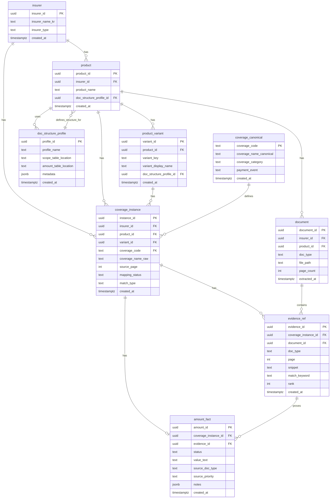

# ERD PHYSICAL – inca-rag-scope

**Version**: 1.0
**Date**: 2025-12-28
**Status**: DESIGN SPECIFICATION (No Implementation)

---

## 0. PURPOSE

Provide a single-page ERD combining **logical and physical** models for all 9 tables in the inca-rag-scope DB schema.

**Scope**: All entities, all relationships, cardinality.
**Out of Scope**: Implementation details (see DB_PHYSICAL_MODEL_EXTENDED.md).

---

## 1. FULL ERD (MERMAID)



---

## 2. RELATIONSHIP SUMMARY

### 2.1 Primary Relationships

| Parent Entity | Cardinality | Child Entity | Constraint | Notes |
|--------------|-------------|--------------|-----------|-------|
| insurer | 1:N | product | MUST EXIST | One insurer has many products |
| insurer | 1:N | coverage_instance | MUST EXIST | One insurer has many coverage instances |
| product | 1:N | product_variant | MUST EXIST | One product has many variants (or 0) |
| product | 1:N | document | MUST EXIST | One product has many documents |
| product | 1:N | coverage_instance | MUST EXIST | One product has many coverage instances |
| product | N:1 | doc_structure_profile | MUST EXIST | Many products share one profile |
| product_variant | 1:N | coverage_instance | OPTIONAL | One variant has many coverage instances (NULL if no variant) |
| coverage_canonical | 1:N | coverage_instance | MUST EXIST | One canonical coverage defines many instances |
| coverage_instance | 1:N | evidence_ref | 0-N | One instance has 0-N evidences |
| coverage_instance | 1:1 | amount_fact | 0-1 | One instance has at most 1 amount |
| document | 1:N | evidence_ref | 0-N | One document contains 0-N evidences |
| evidence_ref | 1:N | amount_fact | 0-N | One evidence proves 0-N amounts |

### 2.2 Cardinality Key

```
||--o{ : One-to-Many (1:N)
||--|| : One-to-One (1:1)
||--o| : One-to-Zero-or-One (1:0..1)
```

---

## 3. KEY RELATIONSHIPS EXPLAINED

### 3.1 Coverage Hierarchy

```
coverage_canonical (정의)
        ↓ 1:N
coverage_instance (실현)
        ↓ 1:N
evidence_ref (증거)
        ↓ 0:N
amount_fact (금액)
```

**Explanation**:
- **coverage_canonical**: "What is this coverage?" (e.g., A4200_1 암진단비(유사암제외))
- **coverage_instance**: "Where does this coverage appear?" (e.g., Samsung product, page 3)
- **evidence_ref**: "Where is the proof?" (e.g., Policy p.7, Business Method p.10)
- **amount_fact**: "How much?" (e.g., 3000만원 from 가입설계서)

### 3.2 Variant Handling

```
product (상품)
    ↓ 1:N
product_variant (변형)
    ↓ 1:N
coverage_instance (담보 인스턴스)
```

**Examples**:

**LOTTE (Gender Variants)**:
```
Product: LOTTE Health Insurance
  ├─ Variant: MALE (남)
  │   └─ Coverage Instance: A4200_1 (3000만원)
  └─ Variant: FEMALE (여)
      └─ Coverage Instance: A4200_1 (5000만원)
```

**DB (Age Variants)**:
```
Product: DB Life Insurance
  ├─ Variant: AGE_20_39
  │   └─ Coverage Instance: A4200_1 (2000만원)
  ├─ Variant: AGE_40_59
  │   └─ Coverage Instance: A4200_1 (3000만원)
  └─ Variant: AGE_60_79
      └─ Coverage Instance: A4200_1 (4000만원)
```

**KB/Meritz (No Variants)**:
```
Product: KB Health Insurance
  ├─ Variant: NULL
  └─ Coverage Instance: A4200_1 (3000만원)
```

### 3.3 Document Structure Profile

```
doc_structure_profile (문서 구조 프로필)
        ↓ 1:N
product (상품)
        ↓ 1:N
document (문서)
```

**Explanation**:
- **doc_structure_profile**: Defines where to find coverage tables, amount tables
- **product**: Uses this profile to parse documents
- **document**: Physical PDF files

**Example**:

**KB Profile**:
```json
{
  "scope_table_location": "page_3_table_2",
  "amount_table_location": "page_5_table_1",
  "metadata": {
    "scope_keywords": ["보장내용"],
    "amount_keywords": ["가입금액"]
  }
}
```

**Meritz Profile**:
```json
{
  "scope_table_location": "page_2_table_1",
  "amount_table_location": "page_4_table_3",
  "metadata": {
    "scope_keywords": ["담보"],
    "amount_keywords": ["보험가입금액"]
  }
}
```

---

## 4. ENTITY CATEGORIES

### 4.1 Metadata Entities (Blue)

**Purpose**: Organizational structure

```
insurer
product
product_variant
doc_structure_profile
document
```

**Characteristics**:
- ✅ Manually defined (not extracted from PDFs)
- ✅ Low change frequency
- ✅ No business logic (structure only)

### 4.2 Canonical Entities (Green)

**Purpose**: Single source of truth

```
coverage_canonical
```

**Characteristics**:
- ✅ Source: 담보명mapping자료.xlsx ONLY
- ✅ Human-curated (no auto-generation)
- ✅ Insurer-independent

### 4.3 Instance Entities (Yellow)

**Purpose**: Insurer-specific facts

```
coverage_instance
evidence_ref
amount_fact
```

**Characteristics**:
- ✅ Extracted from PDFs (scope CSV, evidence_pack JSONL, coverage_cards JSONL)
- ✅ High change frequency (per product/variant)
- ✅ Insurer-specific (same canonical code, different amounts)

---

## 5. DATA FLOW (CONCEPTUAL)

```
┌─────────────────────────────────────────────┐
│  SOURCE DATA (Excel, PDFs, CSV, JSONL)     │
└─────────────────────────────────────────────┘
                    ↓
┌─────────────────────────────────────────────┐
│  STEP 9: DB Population                      │
│  (Load → Transform → Validate)              │
└─────────────────────────────────────────────┘
                    ↓
┌─────────────────────────────────────────────┐
│  DB TABLES (9 tables)                       │
│                                             │
│  Metadata: insurer, product, variant        │
│  Canonical: coverage_canonical              │
│  Instances: coverage_instance, evidence,    │
│             amount_fact                     │
└─────────────────────────────────────────────┘
                    ↓
┌─────────────────────────────────────────────┐
│  QUERIES (Comparison, Analysis, Reports)    │
└─────────────────────────────────────────────┘
```

---

## 6. FK RELATIONSHIPS (COMPLETE LIST)

### 6.1 FK Constraints

```sql
-- product references insurer
product.insurer_id → insurer.insurer_id

-- product references doc_structure_profile
product.doc_structure_profile_id → doc_structure_profile.profile_id

-- product_variant references product
product_variant.product_id → product.product_id

-- product_variant references doc_structure_profile (optional)
product_variant.doc_structure_profile_id → doc_structure_profile.profile_id

-- document references insurer
document.insurer_id → insurer.insurer_id

-- document references product
document.product_id → product.product_id

-- coverage_instance references insurer
coverage_instance.insurer_id → insurer.insurer_id

-- coverage_instance references product
coverage_instance.product_id → product.product_id

-- coverage_instance references product_variant (nullable)
coverage_instance.variant_id → product_variant.variant_id

-- coverage_instance references coverage_canonical
coverage_instance.coverage_code → coverage_canonical.coverage_code

-- evidence_ref references coverage_instance
evidence_ref.coverage_instance_id → coverage_instance.instance_id

-- evidence_ref references document
evidence_ref.document_id → document.document_id

-- amount_fact references coverage_instance
amount_fact.coverage_instance_id → coverage_instance.instance_id

-- amount_fact references evidence_ref (nullable, MANDATORY if CONFIRMED)
amount_fact.evidence_id → evidence_ref.evidence_id
```

---

## 7. UNIQUE CONSTRAINTS

### 7.1 Uniqueness Rules

| Table | Unique Constraint | Rationale |
|-------|------------------|-----------|
| insurer | insurer_id (PK) | One row per insurer |
| product | product_id (PK) | One row per product |
| product_variant | variant_id (PK) | One row per variant |
| doc_structure_profile | profile_id (PK) | One row per profile |
| document | document_id (PK) | One row per document |
| coverage_canonical | coverage_code (PK) | One row per canonical coverage |
| coverage_instance | (product_id, variant_id, coverage_code) | One coverage per product/variant |
| evidence_ref | evidence_id (PK) | One row per evidence |
| amount_fact | coverage_instance_id | One amount per coverage instance |

---

## 8. CHECK CONSTRAINTS (SUMMARY)

### 8.1 Amount Fact Constraints

```sql
-- CONFIRMED amounts MUST have evidence
(status = 'CONFIRMED' AND evidence_id IS NOT NULL AND value_text IS NOT NULL) OR
(status != 'CONFIRMED')

-- PRIMARY source can ONLY be 가입설계서
(source_priority = 'PRIMARY' AND source_doc_type = '가입설계서') OR
(source_priority = 'SECONDARY' AND source_doc_type IN ('약관', '사업방법서', '상품요약서')) OR
(source_priority IS NULL)
```

### 8.2 Evidence Ref Constraints

```sql
-- Non-empty snippet
length(snippet) > 0

-- Valid page number
page > 0

-- Valid rank (1-3)
rank BETWEEN 1 AND 3
```

### 8.3 Coverage Canonical Constraints

```sql
-- Coverage code format
coverage_code ~ '^[A-Z]\d{4}(_\d+)?$'
```

---

## 9. INDEX SUMMARY

### 9.1 Primary Indexes (PKs)

All tables have PK indexes (auto-created):
- `insurer.insurer_id`
- `product.product_id`
- `product_variant.variant_id`
- `doc_structure_profile.profile_id`
- `document.document_id`
- `coverage_canonical.coverage_code`
- `coverage_instance.instance_id`
- `evidence_ref.evidence_id`
- `amount_fact.amount_id`

### 9.2 Secondary Indexes (FKs + Common Queries)

**coverage_instance**:
- `idx_coverage_instance_insurer` ON `insurer_id`
- `idx_coverage_instance_product` ON `product_id`
- `idx_coverage_instance_coverage_code` ON `coverage_code`
- `idx_coverage_instance_mapping_status` ON `mapping_status`

**evidence_ref**:
- `idx_evidence_coverage_instance` ON `coverage_instance_id`
- `idx_evidence_document` ON `document_id`
- `idx_evidence_doc_type` ON `doc_type`
- `idx_evidence_rank` ON `rank`

**amount_fact**:
- `idx_amount_coverage_instance` ON `coverage_instance_id`
- `idx_amount_status` ON `status`
- `idx_amount_priority` ON `source_priority`

**coverage_canonical**:
- `idx_coverage_category` ON `coverage_category`
- `idx_coverage_name_canonical` ON `coverage_name_canonical`

---

## 10. CROSS-INSURER COMPARISON QUERY PATTERN

### 10.1 Example Query: Compare Samsung vs Meritz for A4200_1

```sql
SELECT
  cc.coverage_code,
  cc.coverage_name_canonical,
  i.insurer_name_kr,
  ci.coverage_name_raw,
  af.status AS amount_status,
  af.value_text AS amount_value,
  af.source_priority,
  COUNT(er.evidence_id) AS evidence_count
FROM coverage_canonical cc
JOIN coverage_instance ci ON cc.coverage_code = ci.coverage_code
JOIN insurer i ON ci.insurer_id = i.insurer_id
LEFT JOIN amount_fact af ON ci.instance_id = af.coverage_instance_id
LEFT JOIN evidence_ref er ON ci.instance_id = er.coverage_instance_id
WHERE cc.coverage_code = 'A4200_1'
  AND i.insurer_id IN ('samsung', 'meritz')
GROUP BY cc.coverage_code, cc.coverage_name_canonical, i.insurer_name_kr, ci.coverage_name_raw, af.status, af.value_text, af.source_priority
ORDER BY i.insurer_name_kr;
```

**Expected Result**:
| coverage_code | coverage_name_canonical | insurer_name_kr | coverage_name_raw | amount_status | amount_value | source_priority | evidence_count |
|---------------|------------------------|----------------|------------------|---------------|-------------|----------------|---------------|
| A4200_1 | 암진단비(유사암제외) | 삼성화재 | 암 진단비(유사암 제외) | CONFIRMED | 3000만원 | PRIMARY | 6 |
| A4200_1 | 암진단비(유사암제외) | 메리츠화재 | 암진단비(유사암제외) | CONFIRMED | 5000만원 | PRIMARY | 6 |

---

## CONCLUSION

This ERD provides a complete view of all 9 tables with:

1. **Relationships**: All FK constraints visualized
2. **Cardinality**: 1:1, 1:N, 0:N clearly marked
3. **Entities**: Metadata, Canonical, Instance categories
4. **Constraints**: PK, FK, UNIQUE, CHECK summarized
5. **Query Patterns**: Cross-insurer comparison example

**Status**: DESIGN LOCKED. Combines logical and physical models.

**Next**: STEP 9 DB Population Spec (load sequence, idempotency, failure recovery)
